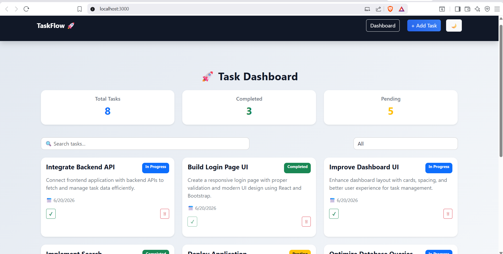
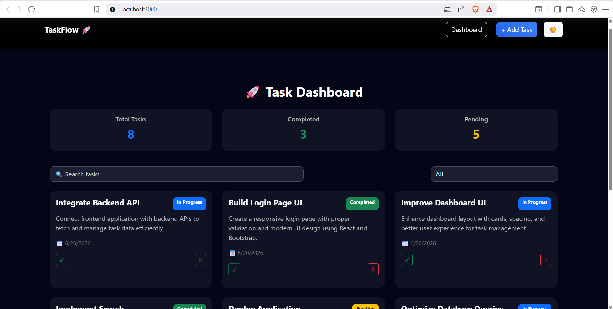
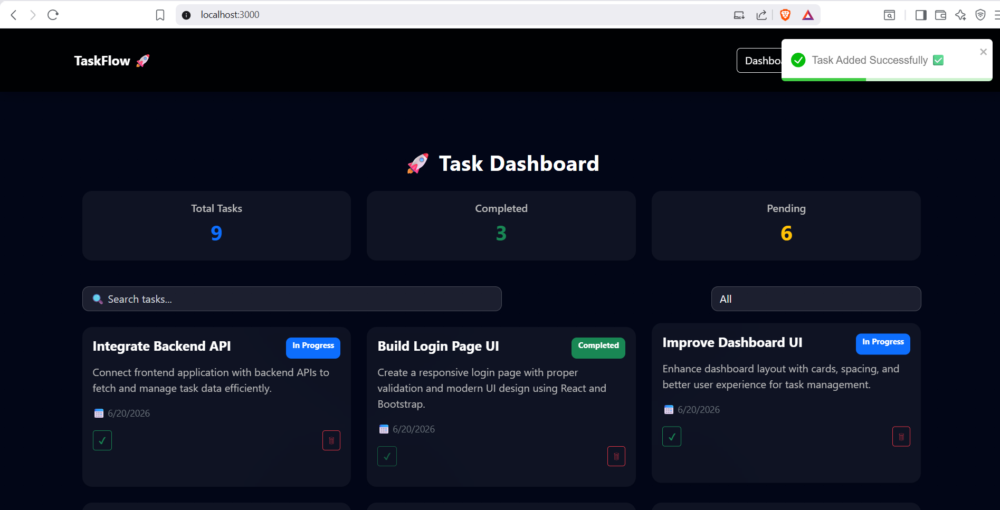
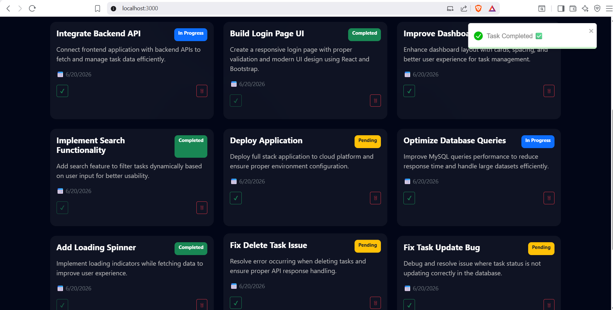
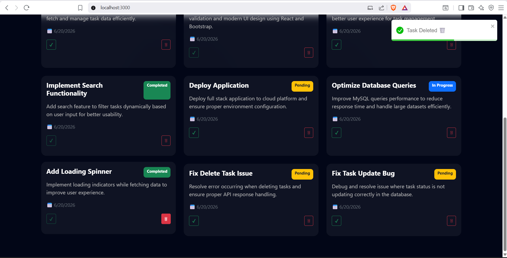
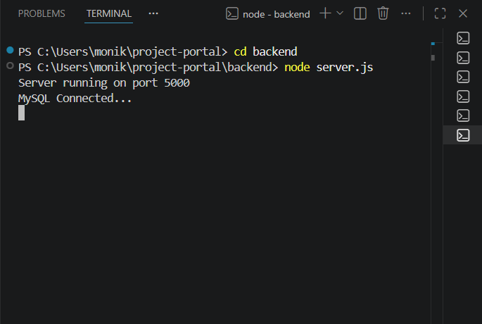
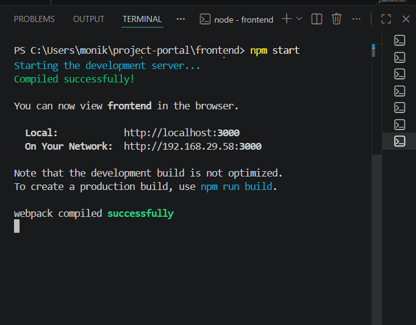
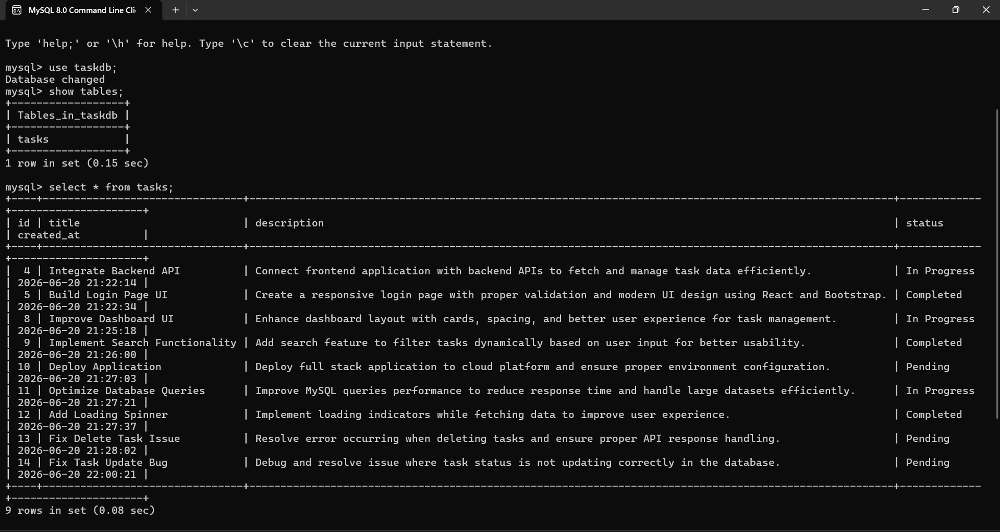
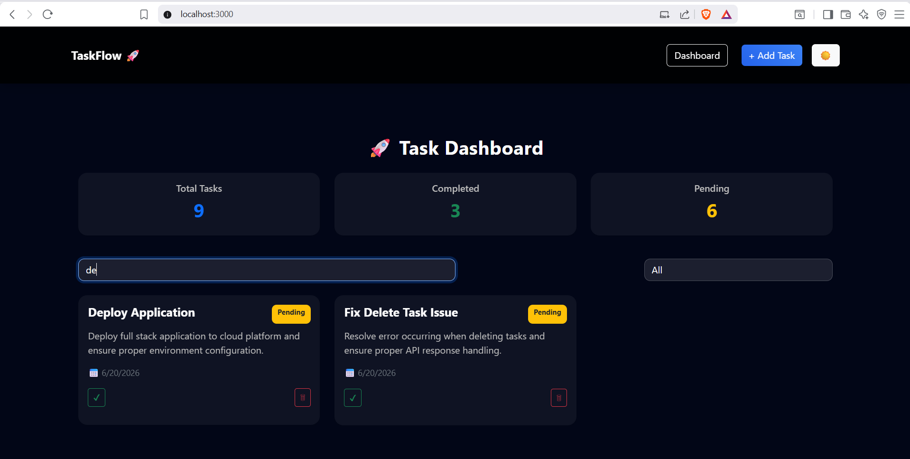
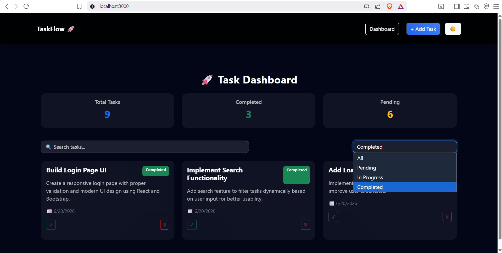

# 🚀 Mini Project Management Portal

A full-stack web application to manage project tasks efficiently.
Users can create, view, update status, delete, and filter tasks with a modern UI.

---

## 📌 Features

* ✅ View all tasks
* ➕ Add new tasks
* ✔ Mark tasks as completed
* 🗑 Delete tasks
* 🔍 Search tasks
* 🎯 Filter tasks (Pending / In Progress / Completed)
* 🌙 Dark Mode Toggle
* 📊 Dashboard Statistics

---

## 🛠 Tech Stack

### Frontend

* React.js
* Bootstrap
* Axios
* React Toastify

### Backend

* Node.js
* Express.js

### Database

* MySQL

---

## 📂 Project Structure

project-root/
│
├── frontend/
│   ├── src/
│   │   ├── pages/
│   │   ├── services/
│   │   ├── App.js
│   │   └── index.js
│
├── backend/
│   ├── config/
│   ├── controllers/
│   ├── routes/
│   └── server.js

---

## ⚙️ Setup Instructions

### 1️⃣ Clone the repository

git clone <your-repo-link>
cd project-root

---

### 2️⃣ Backend Setup

cd backend
npm install
node server.js

---

### 3️⃣ Frontend Setup

cd frontend
npm install
npm start

---

## 🗄 Database Setup (MySQL)

Create database:

CREATE DATABASE taskdb;
USE taskdb;

CREATE TABLE tasks (
  id INT AUTO_INCREMENT PRIMARY KEY,
  title VARCHAR(255),
  description TEXT,
  status VARCHAR(50),
  created_at TIMESTAMP DEFAULT CURRENT_TIMESTAMP
);

---

## 🔗 API Endpoints

| Method | Endpoint   | Description        |
| ------ | ---------- | ------------------ |
| GET    | /tasks     | Get all tasks      |
| POST   | /tasks     | Create task        |
| PUT    | /tasks/:id | Update task status |
| DELETE | /tasks/:id | Delete task        |

---

## 📸 Screenshots

### 🖥 Dashboard (Light Mode)

### 🌙 Dashboard (Dark Mode)

### ➕ Add Task

### ✔ Complete Task

### 🗑 Delete Task

### 💻 Backend Terminal

### 💻 Frontend Terminal

### 🗄 MySQL Database

### 🔍 Search Tasks

### 🎯 Task Filter (Completed View)

---

## 💡 Assumptions

* User authentication is not included
* Single user system
* Tasks are managed locally without login

---

## 🧪 Future Improvements

* 🔐 User Authentication (JWT)
* 📄 Pagination
* 🔽 Sorting by date
* 📊 Advanced analytics
* 🧩 Unit Testing

---

## 👩‍💻 Author

**Mounika Praneetha**
B.Tech AIML Student

---

## ⭐ Conclusion

This project demonstrates full-stack development skills including API integration, database design, and responsive UI development.
